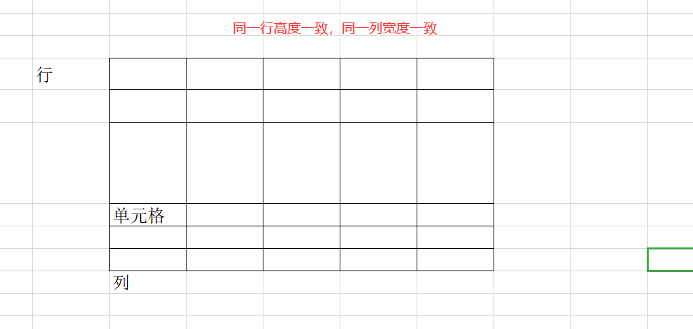
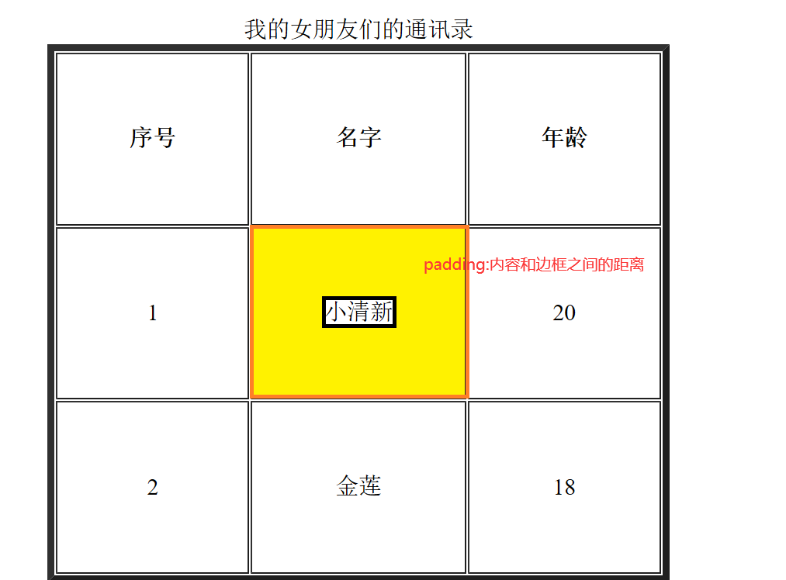

# 表格

## 学习目标

1、创建表格

2、适当的美化表格

3、表格中的单元格的合并

4、表格的嵌套

# 学习内容

# 1、认识表格



# 2、创建表格

- table：表格
- tr:行
- td:单元格
- th: 标题单元格 ：内容居中 、字体加粗
- caption:表格标题

```html
<table>
	<tr>
		<td>单元格</td>
	</tr>
</table>
```

栗子：

```html
<!-- border="1":修饰表格的边框的宽度，默认是0 -->
	<table border="5" width="500" height="300">
		<caption>我的女朋友们的通讯录</caption>
		<tr>
			<th>序号</th>
			<th>名字</th>
			<th>年龄</th>
		</tr>
		<tr>
			<td>单元格1</td>
			<td>单元格1</td>
			<td>单元格1</td>
		</tr>
		<tr>
			<td>单元格1</td>
			<td>单元格1</td>
			<td>单元格1</td>
		</tr>
	</table>
```

# 3、表格美化

常用的属性：

- cellspacing="0" ：控制表格中的单元格的间隙，默认：1 ；只能用在table上
- cellpadding="1":控制单元格中的内容和单元格边框的距离（间距）；只能用在table上
- align:水平对齐方式：left | center | right ;可以用在table, tr, td ,th
- width,height:可以用在table ,tr, td上
- bgColor:背景颜色：可以用在table, tr, td ,th
- background="图片路径" ；可以用在table, tr, td ,th
- bordercolor="blue": 表格边框的颜色
- 

示例：

```html
<!-- border="1":修饰表格的边框的宽度，默认是0 -->
	<table border="5" width="500" height="200"  align="center" cellspacing="0" cellpadding="1"  background="../images/4.gif">
		<caption>我的女朋友们的通讯录</caption>
		<tr bgColor="yellow">
			<th>序号</th>
			<th bgColor="red">名字</th>
			<th>年龄</th>
		</tr>
		<tr align="center">
			<td>1</td>
			<td>小清新</td>
			<td>20</td>
		</tr>
		<tr  align="center">
			<td>2</td>
			<td>金莲</td>
			<td>18</td>
		</tr>
	</table>
```

# 4、表格单元格合并

跨列合并：colspan="n" :n:代表 合并 列 的个数

跨行合并：rowspan="n" : n:代表 合并 行 的个数

```html
<table border="1" width="500">
	<tr>
		<td colspan="3">1</td>
	</tr>
	<tr>
		<td>4</td><td>5</td><td rowspan="2">6</td>
	</tr>
	<tr>
		<td>7</td><td>8</td>
	</tr>
</table>
```

# 5、表格的嵌套


```html
<table border="1" align="center" width="500" cellspacing="0" cellpadding="0">
		<tr>
			<td>1</td>
		</tr>
		<tr >
			<td>
					<!-- 嵌套表格的开始 -->
						<table width="100%" border="0" cellspacing="0" cellpadding="0">
							<tr>
								<td width="20%">1</td>
								<td width="80%">
										<!-- 2*2表格开始 -->
											<table width="100%" border="0" cellspacing="0" cellpadding="0">
												<tr align="center">
													<td></td>
													<td></td>
												</tr>
												<tr align="center">
													<td></td>
													<td></td>
												</tr>
											</table>
										<!-- 2*2表格结束 -->
								</td>
							</tr>
						</table>
					<!-- 嵌套表格的结束 -->
			</td>
		</tr>
</table>
```

# 总结

1、熟练度

2、设计各种类型的表格：通讯录、个人简历


